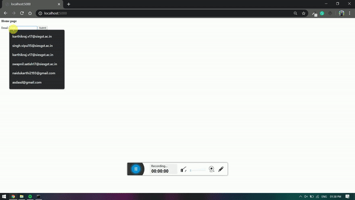

# Student Performance Analysis

## About
This Flask website is a dashboard for keeping track of personal progress on http://arena.siesgst.ac.in/  
This project gives a coder analysis on the submissions made by him and recommends Problems to him according to Topics solved/unsolved 
 
 
<b>For Unsolved Topics</b>
 
System provides problems in increasing difficulty 
 
<b>For Solved Topics</b>
 
System provides top 5 problems of Higher  difficulty which has not been solved yet

#### This project has been deployed on https://arena-siesgst-dashboard.herokuapp.com/

## Installation

### Install Dependencies
> <b>pip</b>: pip install -r requirements.txt
>  
<b>conda</b>:  conda install --yes --file requirements.txt

### Execute Code
>python main.py

### To view Dashboard (in Browser) goto following link once server starts
>http://localhost:5000/

#### Layouts are visible properly at 67% zoom in browser

## Dataset
The Data collected from Databases are stored inside Data folder in the following files
- users.json
- submissions.json
- problems.json

## Results

